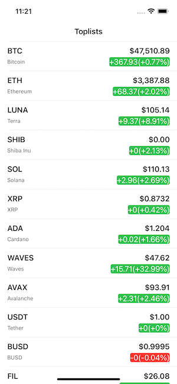
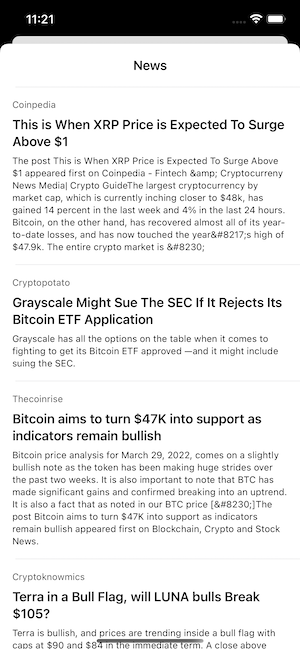

# CryptoList

iOS App that displays live price updates list of most active cryptocurrencies with current news.

## Screenshot

## Requirement:
- [x] Display a list of at least 50 tickers
- [x] Display news related to the currency selected upon tapping a cell
- [x] Show live price updates using Web Socket
- [x] Pull to refresh from the Toplist
- [x] Show the correct ticker color (green when the price increases and red for the opposite)
- [x] Handle network errors

## Solution:
- Using URLSession for load data coin and news
- Using URLSessionWebSocketTask for load live price updates from Websocket

## TODO:
- Unit Testing for WebSocket layer (in research)
- Generic in Unit Testing (Reusable Testing)

## How to install :
- Make sure you have Xcode 13.2.1 or above
- Open CryptoList.xcodeproj
- Run unit testing using `cmd + U`
- Run project to simulator or real device using `cmd + R`
